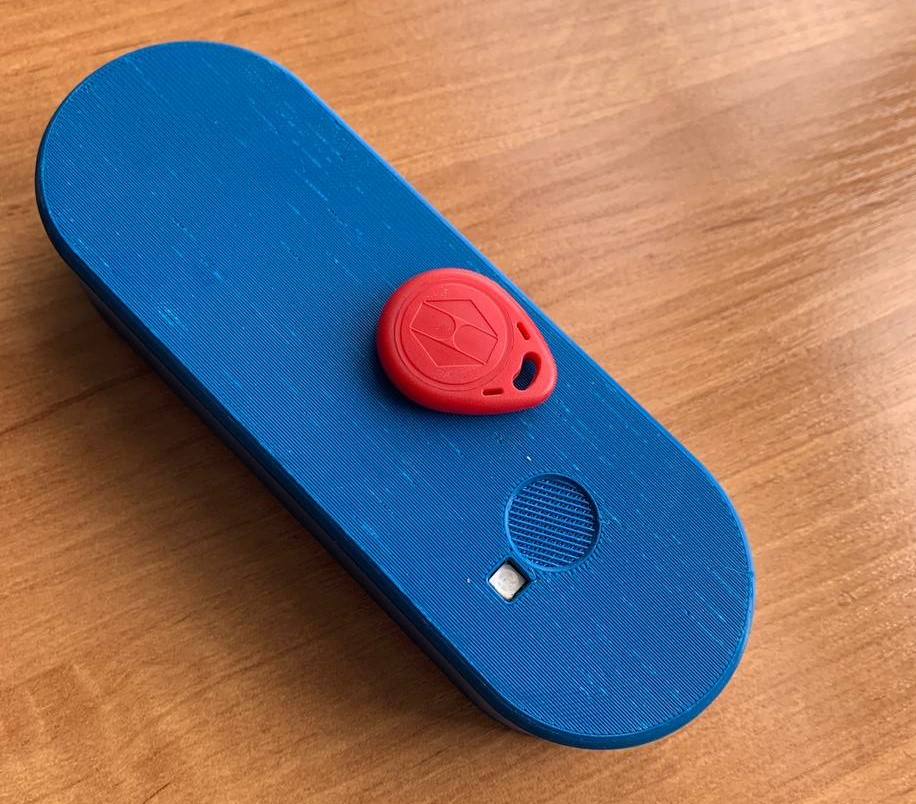
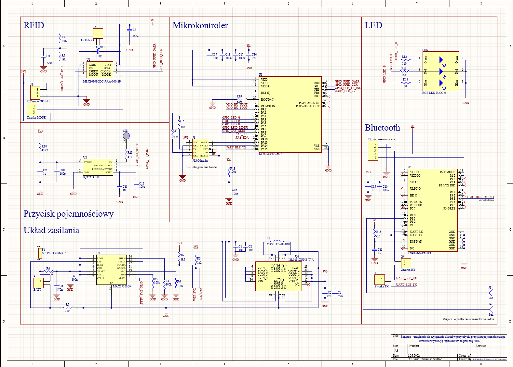
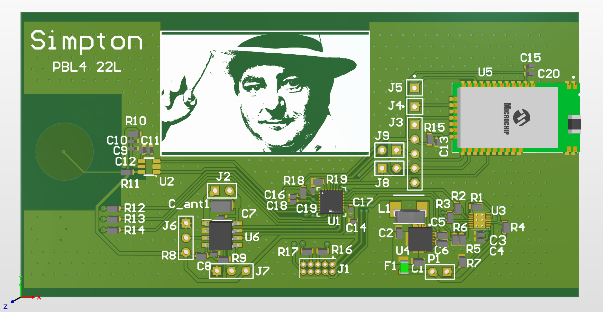

# Simpton - smart wireless button with RFID

## Overview

Simpton is a wireless (Bluetooth LE) button with RFID reader. It can be used to manage access to buildings without changes to the structure of the building.

It was created by Karol Duszczyk, Michał Twarowski and Kamil Wieteska on PBL-4 classes (spring 2022) as part of the Internet of Things studies at the Warsaw University of Technology.

# Hardware

## Technology used

### Tools
- Altium Designer
- Fushion 360
- Soldering iron, soldering oven
- 3D printer

### Parts
- microcontroller STM32L031G6U7
- capacitive button IQS227B00000000TSR
- 125 kHz RFID reader MLX90109CDC-AAA-000-SP
- voltage regulator ISL91110IRNZ-T7A
- battery gauge MAX17201G+T
- BLE module RN4870-V/RM118
- RGB diode
- PPTC, RFID antenna, 18650 battery, R, L, C, connectors...

## Results

### Schematic

Schematic was created in Altium Designer. It has 6 parts:
- capacitive button, LED by Karol
- RFID by Michał
- power module by Kamil
- BLE, microcontroller by all together

### PCB

## Bugs found

- There is an unresolved problem with a battery gauge. It can't connect to uC by I2C. Probably wrong connection to one of the VCC pins (3.3 V instead of 1.8 V).
- There should be added switch to disconnect battery.

# Software

## Technologies used
- C language
- STM32CubeIDE
- Segger J-Link EDU

## Results

We created working prototype without a power gauge.

Working cycle:
1. Sleep
2. Wake up when button pressed (by interrupt)
3. Power on BLE and blink blue LED
4. Power on RFID reader and wait up to 10 s to read RFID card
    1. If no card was presented turn off RFID and BLE, blink red led and go to sleep (return to point 1)
5. Blink green LED once. If there isn't BLE connection wait up to 10 s to get it.
    1. If there still isn't connection turn off RFID and BLE, blink red led twice and go to sleep (return to point 1)
6. Send RFID tag number by BLE and blink green LED twice
7. (not implemented) Read battery status from gauge and send it by BLE
8. Turn off RFID and BLE and go to sleep (return to point 1)

Every device module has it's own driver and library for it's hardware part.

Code modules:
- state_machine - simple state machine by Karol
- rfid_driver & mlx90109cdc - RFID library by Michał
- gauge_driver & max17201 - gauge library by Kamil
- ble_driver & rn4870 - BLE library by Karol

## Bugs found

- STM32L031G6U7 has too low Flash memory.
- UART (used to communicate with BLE) has unresolved problem with receiving data (sometimes receives and sometimes not).